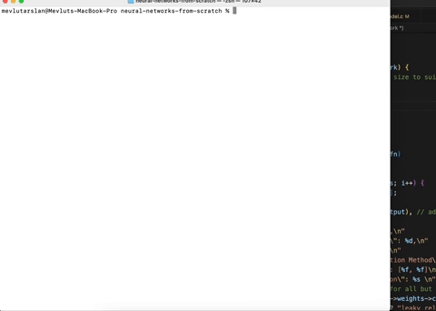

# Basic Neural Network Library in C

This project is my educational journey into the world of neural networks and machine learning. Developed from scratch in C, the project is a fundamental implementation of a neural network library. It provides the essential components required to construct and train neural network models.



## Features

- **Common layer types**: The library supports dense layers, with plans to add more as my understanding expands.
- **Activation functions**: It includes a variety of activation functions such as ReLU, leaky ReLU, softmax, and more to come.
- **Loss functions**: It supports different loss functions such as categorical cross-entropy and mean squared error.
- **Optimization algorithms**: The library includes various optimization algorithms such as stochastic gradient descent, ADAGRAD, RMS_PROP, and ADAM.
- **Backpropagation algorithms**: It comes with backpropagation algorithms for computing gradients.
- **Data pre-processing and normalization**: It provides functionalities for data pre-processing and normalization.

## Goal

The primary aim of this library is to serve as a "playground" for understanding the underlying mathematical concepts and algorithms that drive neural networks and deep learning. By building it from the ground up in C, one can learn and customize all aspects of the implementation. 

## Note

While the library's performance and production-readiness are not the main focus, it serves as an educational tool for hands-on learning. Contributions and improvements are always welcome!

## Performance
The version on the main branch does not come with any performance optimizations, its priority was/is readability and understandability. If you want a more performant version or want to see how neural networks can be optimized take a look at the branch 'optimized-branch'.

* It only supports batch processing.
* It doesn't have the latest changes I have on the main branch, I will be migrating the changes slowly overtime.

It has the following optimizations:
1. Optimized Memory access
2. Refactored Matrix struct to allow for easier integration of CUDA.
3. A thread pool for utilizing POSIX threads and reducing the overhead that comes with thread creation.
4. CUDA support for operations that were causing heavy performance issues.

Here is the average time it takes to run wine-categorization model on different versions:
1. Non-optimized sequential version: 39ms.
2. Non-optimized batched version: 85ms.
3. Optimized (ThreadPool and/or CUDA) versions take significantly longer as the overhead introduced by parallelization, which outweighs the performance gains for smaller operations.

Here is the average time it takes to run MNIST model on different versions:
1. Non-Optimized sequential version: 70.9417 minutes.
2. Optimized batched version: 18.245 minutes.

## Memory Management

My recent refactoring efforts have significantly reduced memory leaks from around 11 million bytes to around 10k bytes during the execution of the Wine Recognition data model. However, the remaining leaks seem to stem from the logging library and a few other unknown sources.

## Example Models

For reference, I've included two example models under 'src/example_networks':

- [MNIST](https://www.kaggle.com/datasets/oddrationale/mnist-in-csv)
- [Wine Recognition Data](https://archive.ics.uci.edu/dataset/109/wine)
- [Real Estate Prediction Data](https://www.kaggle.com/datasets/quantbruce/real-estate-price-prediction)

Please feel free to delve into these models to gain a better understanding of the project's workings.

## Feedback

I appreciate any feedback that could help improve my skills. Please don't hesitate to share your insights.

## Road Map

1. [X] Add Multithreading for matrix operations.
2. [X] CUDA support.
3. [X] Add an example model for regression.
4. [ ] Implement Transformers 

## Prerequisites

Before you begin, ensure you have met the following requirements:

* You have installed the latest version of `gcc`.
* You have a `<Linux/Mac>` machine. 
* TODO: Provide link to documentation

## Installing 

To install, follow these steps:

1. Install `libcsv`:
   * `brew install libcsv`

2. Install `gnuplot` on your system. The method for this varies depending on your operating system:

   * On Ubuntu, you can use `sudo apt-get install gnuplot`.
   * On macOS, you can use `brew install gnuplot`.

3. Clone the repository:
```bash
git clone <repository_link>
```

4. Navigate to the project directory:
```bash
cd <repository_directory>
```

5. Compile the project:
```bash
make
```